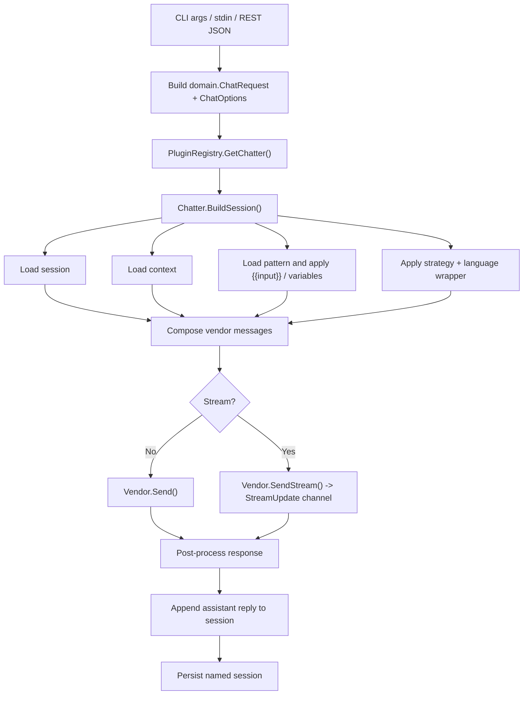

# Pipeline Fixes Implementation Plan

> **For Claude:** REQUIRED SUB-SKILL: Use superpowers:executing-plans to implement this plan task-by-task.

**Goal:** Align the current Fabric request pipeline across CLI and REST, separate composed system prompt parts cleanly, and remove the streaming error deadlock risk.

**Architecture:** Keep `core.Chatter.BuildSession` as the single source of truth for prompt assembly. The REST layer should build a `domain.ChatRequest` and let `BuildSession` apply strategy, context, pattern, and user input the same way as the CLI path. Streaming error handling should capture the first error without blocking the sender goroutine.

**Tech Stack:** Go, Gin, Fabric `core`/`domain`/`fsdb` packages, Go testing

---

## Current Flow

## Task 1: Unify Request Assembly

**Files:**
- Modify: `internal/server/chat.go`
- Test: `internal/server/chat_test.go`

**Step 1:** Remove REST-side strategy prompt injection into `userInput`.

**Step 2:** Add a helper that converts `PromptRequest` into `domain.ChatRequest` while preserving `StrategyName`.

**Step 3:** Route the REST path through the same strategy semantics as the CLI path.

## Task 2: Fix System Prompt Composition

**Files:**
- Modify: `internal/core/chatter.go`
- Test: `internal/core/chatter_test.go`

**Step 1:** Replace direct string concatenation of context and pattern content with a separator-aware join helper.

**Step 2:** Verify the resulting system message keeps strategy, context, and pattern distinct.

## Task 3: Harden Streaming Error Handling

**Files:**
- Modify: `internal/core/chatter.go`
- Test: `internal/core/chatter_test.go`

**Step 1:** Capture only the first stream error and never block the streaming goroutine on duplicate error reporting.

**Step 2:** Add a regression test where a vendor emits `StreamTypeError` and also returns an error from `SendStream`.

## Task 4: Verification

**Files:**
- Test: `internal/core/chatter_test.go`
- Test: `internal/server/chat_test.go`

**Step 1:** Run focused package tests for `internal/core` and `internal/server`.

**Step 2:** Confirm the new tests cover:
- REST request construction preserving `StrategyName`
- newline-separated system prompt assembly
- non-blocking streaming error propagation
