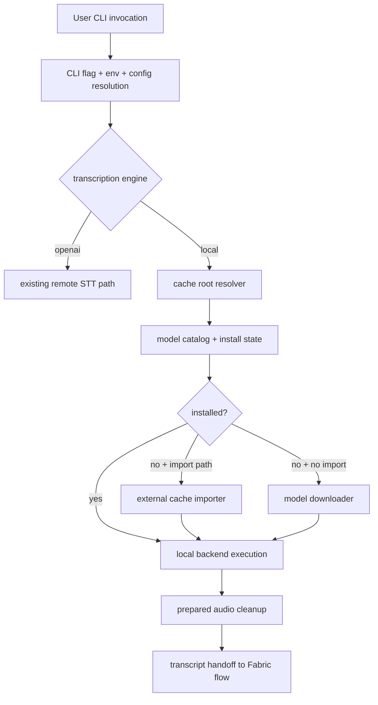

# Fabric Local Transcription Cache BLUEPRINT

References:

1. SPEC: [2026-03-14-local-transcription-cache-spec.md](docs/plans/2026-03-14-local-transcription-cache-spec.md)
2. Current remote STT implementation: [transcribe.go](internal/cli/transcribe.go)
3. Current OpenAI audio implementation: [openai_audio.go](internal/plugins/ai/openai/openai_audio.go)
4. Reference standalone cache behavior: [<external-reference>/transcription_pipeline/cli.py](<external-reference>/transcription_pipeline/cli.py)

Status: Pre-implementation blueprint  
Date: 2026-03-14  
Scope: exhaustive implementation detail for Fabric-native local transcription cache and model lifecycle

## 1. Expansion Plan

The SPEC contains 17 sections and defines the contract clearly enough to implement, but the implementation still needs the following details locked down:

1. Exact path normalization and validation rules.
2. Canonical model catalog rows and alias normalization behavior.
3. Exact manifest shape for imported and downloaded assets.
4. First-run setup, direct-run auto-install, and explicit import sequences.
5. Full error catalog with codes, message templates, and recovery rules.
6. Validation examples for cache paths, model names, install states, and import sources.
7. Edge cases around partial installs, invalid cache contents, backend auto-selection, and prepared audio cleanup.

This BLUEPRINT fills those gaps and is intentionally implementation-facing rather than explanatory.

## 2. System Context

Fabric currently has:

1. a config home rooted at `~/.config/fabric`,
2. a remote transcription CLI entrypoint,
3. a general CLI/config resolution system,
4. no Fabric-owned local model cache contract.

The new subsystem adds a parallel local transcription model store and asset lifecycle. The core implementation principle is:

`config in config home, model binaries in cache home, transcripts elsewhere`

### 2.1 Context Diagram



## 3. Entity Catalog

## 3.1 `CacheRoots`

| Field | Type | Required | Default | Validation | Invalid Behavior | Usage Sites |
|---|---|---:|---|---|---|---|
| `config_dir` | string | yes | `~/.config/fabric` | expand `~`, clean, abs, must exist or be creatable | fail with `LT001` | CLI init, config load |
| `cache_root` | string | yes | `os.UserCacheDir()/fabric` | expand `~`, clean, abs, must exist or be creatable | fail with `LT001` | all local cache operations |
| `model_cache_dir` | string | yes | `join(cache_root, "models")` | descendant of `cache_root`, abs | fail with `LT001` | model catalog, importer, downloader |
| `prepared_audio_dir` | string | yes | `join(cache_root, "transcription", "prepared")` | descendant of `cache_root`, abs | fail with `LT001` | local run temp assets |
| `metadata_dir` | string | yes | `join(cache_root, "transcription", "metadata")` | descendant of `cache_root`, abs | fail with `LT001` | install/import manifests |

Normalization pipeline:

1. Input path
2. `os.ExpandEnv`
3. `filepath.Clean`
4. `filepath.Abs`
5. descendant enforcement where required

Examples:

1. `~/Library/Caches/fabric` -> `~/Library/Caches/fabric`
2. `~/.cache/fabric/../fabric/models` -> `/Users/<user>/.cache/fabric/models`
3. `/tmp/../tmp/fabric-cache` -> `/tmp/fabric-cache`

## 3.2 `CatalogEntry`

| Field | Type | Required | Default | Validation | Invalid Behavior | Usage Sites |
|---|---|---:|---|---|---|---|
| `logical_name` | string | yes | none | regex `^[a-z0-9._-]+$` | panic in internal catalog init tests; user-facing config never sees invalid rows | model resolution |
| `family` | enum | yes | none | `transcription`, `diarization` | fail startup tests | setup, list, run |
| `backend` | enum | yes | none | `mlx-whisper`, `faster-whisper`, `pyannote` | fail startup tests | setup, list, run |
| `remote_identifier` | string | yes | none | non-empty | fail startup tests | downloader |
| `relative_cache_path` | string | yes | none | relative only, no leading slash | fail startup tests | importer, downloader, validation |
| `install_method` | enum | yes | none | `lazy-download`, `hf-download` | fail startup tests | downloader |
| `aliases` | []string | yes | empty | each non-empty | ignore duplicates after normalization | CLI model parsing |
| `required_files` | []string | yes | empty | each relative | empty only if validator is custom | install validation |

Canonical V1 catalog rows:

| logical_name | family | backend | remote_identifier | relative_cache_path |
|---|---|---|---|---|
| `large-v3` | transcription | `mlx-whisper` | `mlx-community/whisper-large-v3-mlx` | `huggingface/hub/models--mlx-community--whisper-large-v3-mlx` |
| `large-v3` | transcription | `faster-whisper` | `Systran/faster-whisper-large-v3` | `models--Systran--faster-whisper-large-v3` |
| `speaker-diarization-community-1` | diarization | `pyannote` | `pyannote/speaker-diarization-community-1` | `huggingface/hub/models--pyannote--speaker-diarization-community-1` |

## 3.3 `InstallManifest`

Manifest file path:

`<metadata_dir>/install-manifest.json`

Canonical shape:

```json
{
  "manifest_version": 1,
  "generated_at": "2026-03-14T11:30:00Z",
  "cache_root": "/Users/example/Library/Caches/fabric",
  "entries": [
    {
      "logical_name": "large-v3",
      "family": "transcription",
      "backend": "mlx-whisper",
      "status": "downloaded",
      "source_kind": "download",
      "source_path": "mlx-community/whisper-large-v3-mlx",
      "resolved_path": "/Users/example/Library/Caches/fabric/models/huggingface/hub/models--mlx-community--whisper-large-v3-mlx",
      "installed_at": "2026-03-14T11:30:00Z"
    }
  ]
}
```

Validation rules:

1. `manifest_version` must equal `1`
2. `entries` may be empty
3. duplicate `(logical_name, backend)` tuples are invalid
4. unknown keys must be ignored

## 3.4 `ImportRequest`

| Field | Type | Required | Default | Validation | Invalid Behavior | Usage Sites |
|---|---|---:|---|---|---|---|
| `source_root` | string | yes | none | abs after normalization, must exist, must be directory | fail `LT002` or `LT003` | explicit import |
| `copy_mode` | enum | yes | `copy` | only `copy` in V1 | fail `LT004` | importer |
| `families` | []enum | yes | `["transcription"]` | values from `transcription`, `diarization` | fail `LT005` | importer |
| `overwrite_existing` | boolean | yes | `false` | no special validation | no-op | importer |

## 3.5 `PreparedAudioArtifact`

Canonical path layout:

`<prepared_audio_dir>/<run_id>/<filename>`

Required sibling metadata file:

`<prepared_audio_dir>/<run_id>/prepare.json`

Canonical `prepare.json` shape:

```json
{
  "run_id": "20260314T113000Z-7f9a",
  "input_path": "/path/to/input.mp4",
  "prepared_audio_path": "/.../prepared/20260314T113000Z-7f9a/input.wav",
  "cleanup_policy": "always-delete",
  "created_at": "2026-03-14T11:30:00Z"
}
```

## 4. Configuration Bible

## 4.1 CLI Flags

### `--transcription-engine`

- Type: enum
- Default: `openai`
- Valid values: `openai`, `local`
- Invalid example: `--transcription-engine foo`
- Error: `LT006`
- Behavioral impact:
  - `openai` routes into existing remote transcription code path
  - `local` activates cache resolver, model catalog, import/download logic, and local backend execution

### `--transcription-backend`

- Type: enum
- Default: `auto`
- Valid values: `auto`, `mlx-whisper`, `faster-whisper`
- Invalid example: `--transcription-backend whisper`
- Error: `LT007`
- Behavioral impact:
  - `auto` resolves backend from runtime rules
  - explicit values bypass host preference logic

### `--transcription-cache-dir`

- Type: path string
- Default: unset
- Valid examples:
  - `--transcription-cache-dir ~/Library/Caches/fabric-dev`
  - `--transcription-cache-dir /tmp/fabric-cache`
- Invalid examples:
  - path points to file
  - path is unwritable
  - path resolves inside a file-like segment
- Error: `LT001`

### `--transcription-import-cache-from`

- Type: path string
- Default: unset
- Valid example:
  - `--transcription-import-cache-from /existing/transcription/.cache/models`
- Invalid examples:
  - missing path
  - regular file
  - directory with zero recognizable model directories
- Errors:
  - missing path -> `LT002`
  - file instead of dir -> `LT003`
  - incompatible contents -> `LT008`

### `--setup-local-transcription`

- Type: boolean
- Default: `false`
- Behavior:
  - create cache directories
  - resolve model and backend
  - import if explicit source is provided
  - otherwise install missing model if auto-download is enabled
  - exit without running transcription

### `--transcription-no-auto-download`

- Type: boolean
- Default: `false`
- Behavior:
  - if required asset is missing after import step, fail with `LT009`

### `--transcription-prepared-audio-policy`

- Type: enum
- Default: `always-delete`
- Valid values: `always-delete`, `always-keep`, `report-only`
- Invalid example: `auto`
- Error: `LT010`

## 4.2 Config Keys

Canonical config block:

```yaml
transcription:
  engine: openai
  local:
    backend: auto
    default_model: large-v3
    cache_dir: ""
    prepared_audio_dir: ""
    auto_download_missing_models: true
    prepared_audio_policy: always-delete
```

Resolution examples:

1. CLI sets engine to `local`; config says `openai` -> effective value `local`
2. config sets backend to `faster-whisper`; CLI omits backend -> effective value `faster-whisper`
3. env sets cache dir; config also sets cache dir -> env wins
4. CLI cache dir set -> CLI wins over env and config

## 4.3 Environment Variables

Supported variables:

| Variable | Type | Purpose |
|---|---|---|
| `FABRIC_TRANSCRIPTION_ENGINE` | string | engine override |
| `FABRIC_LOCAL_TRANSCRIPTION_BACKEND` | string | backend override |
| `FABRIC_LOCAL_TRANSCRIPTION_CACHE_DIR` | string path | cache root override |
| `FABRIC_LOCAL_TRANSCRIPTION_PREPARED_AUDIO_DIR` | string path | prepared audio override |
| `FABRIC_LOCAL_TRANSCRIPTION_AUTO_DOWNLOAD` | boolean string | auto-download override |
| `HF_TOKEN` | secret string | Hugging Face token |
| `HUGGINGFACE_HUB_TOKEN` | secret string | fallback token name |

Secret precedence:

1. `HF_TOKEN`
2. `HUGGINGFACE_HUB_TOKEN`

If both are empty, pyannote download is blocked but transcription model download may still proceed when no HF auth is needed.

## 5. State Transition Matrix

## 5.1 Model State Matrix

| Current State | Trigger | Condition | Action | Next State | Side Effects |
|---|---|---|---|---|---|
| `missing` | inspect | final dir absent | none | `missing` | none |
| `missing` | import | source valid and copy succeeds | write manifest | `imported` | copy subtree |
| `missing` | import | source invalid | raise `LT008` | `missing` | none |
| `missing` | download | download + validate succeeds | write manifest | `downloaded` | network + disk |
| `missing` | download | staged install fails | mark partial cleanup candidate | `partial` | staging dir |
| `partial` | retry | cleanup succeeds then download succeeds | write manifest | `downloaded` | cleanup old partial |
| `partial` | retry | cleanup succeeds then import succeeds | write manifest | `imported` | cleanup old partial |
| `downloaded` | inspect | validator fails | mark corrupt | `corrupt` | update manifest |
| `imported` | inspect | validator fails | mark corrupt | `corrupt` | update manifest |
| `corrupt` | redownload | replace final dir after staging | `downloaded` | remove invalid dir |
| `corrupt` | reimport | replace final dir after copy | `imported` | remove invalid dir |

## 5.2 Prepared Audio Lifecycle

| Current State | Trigger | Condition | Action | Next State |
|---|---|---|---|---|
| `absent` | prepare run | local transcription starts | create run dir + metadata | `present` |
| `present` | run success | policy `always-delete` | delete run dir | `deleted` |
| `present` | run success | policy `always-keep` | keep run dir | `present` |
| `present` | run success | policy `report-only` | leave run dir and emit warning/info | `present` |
| `present` | run failure | policy `always-delete` | delete run dir | `deleted` |
| `present` | run failure | policy not delete | keep run dir | `present` |

## 6. Sequence Specifications

## 6.1 Sequence A: `fabric --setup-local-transcription`

1. Resolve config, env, and CLI.
2. Resolve `CacheRoots`.
3. Create `cache_root`, `model_cache_dir`, `prepared_audio_dir`, and `metadata_dir` if absent.
4. Resolve effective local model:
   - CLI `--transcribe-model` if present
   - config `transcription.local.default_model`
   - fallback `large-v3`
5. Resolve effective backend:
   - CLI `--transcription-backend`
   - env override
   - config override
   - fallback `auto`
6. Build required catalog entries:
   - host-selected transcription backend entry for `large-v3`
   - optional diarization entry only if explicitly requested in a later phase
7. Inspect install state for each required entry.
8. If an explicit import source is provided:
   - validate source
   - copy compatible subtree(s)
   - validate destination(s)
9. For any still-missing entry:
   - if auto-download is disabled, return `LT009`
   - otherwise download, stage, validate, promote
10. Write or update `install-manifest.json`.
11. Exit `0` with human-readable summary.

## 6.2 Sequence B: `fabric --list-transcription-models --transcription-engine local`

1. Resolve config and cache roots.
2. Load catalog rows.
3. Resolve host/backend preference summary.
4. Inspect install state for each row.
5. Render table with:
   - logical name
   - backend
   - installed status
   - resolved path when installed
6. Exit `0`.

Decision table:

| Input | Action |
|---|---|
| engine omitted | use existing remote list behavior |
| engine local | render local catalog |
| cache missing | show rows as `missing`; do not fail |

## 6.3 Sequence C: direct local transcription run

1. User invokes `fabric --transcribe-file <file> --transcription-engine local`.
2. Resolve effective local model and backend.
3. Ensure required assets using import/download logic.
4. Prepare audio into `<prepared_audio_dir>/<run_id>/`.
5. Invoke selected backend.
6. On success:
   - return transcript text into existing Fabric flow
   - cleanup prepared audio according to policy
7. On failure:
   - cleanup prepared audio according to policy
   - return original execution error

Important nuance:
Asset install happens inside the direct run path as a convenience. `--setup-local-transcription` is optional, not mandatory.

## 6.4 Sequence D: explicit import

1. Normalize and validate source path.
2. For each required catalog entry, compute source candidate:
   - `join(source_root, relative_cache_path)`
3. Check candidate existence.
4. Validate candidate shape using required file checks.
5. Create target parent directories under Fabric cache.
6. Copy candidate subtree into a temporary destination.
7. Validate temporary destination.
8. Promote temporary destination to final destination.
9. Update manifest.

## 6.5 Sequence E: download and promotion

1. Resolve target final directory from `relative_cache_path`.
2. Resolve staging directory as sibling:
   - `<final_dir>.staging-<run_id>`
3. Delete stale staging dir if it exists.
4. Download asset into staging dir.
5. Validate staging dir.
6. Promote by atomic rename where filesystem permits.
7. If rename fails due to cross-device condition, perform safe copy-then-rename into target parent.
8. Update manifest.
9. Remove staging dir.

## 6.6 Sequence F: prepared audio cleanup

1. Read effective policy.
2. If `always-delete`, remove run directory recursively.
3. If `always-keep`, leave directory intact.
4. If `report-only`, leave directory intact and emit note.
5. If deletion fails, emit `LT012` warning and continue.

## 7. Integration Specifications

## 7.1 OS Cache Root Resolution

Implementation requirement:

1. Use `os.UserCacheDir()`
2. Append `fabric`
3. Never hardcode `~/.cache/fabric` on macOS

Examples:

| Host | `os.UserCacheDir()` example | Fabric cache root |
|---|---|---|
| macOS | `/Users/alex/Library/Caches` | `/Users/alex/Library/Caches/fabric` |
| Linux | `/home/alex/.cache` | `/home/alex/.cache/fabric` |

## 7.2 External Cache Compatibility Rules

Recognized directories:

1. `huggingface/hub/models--mlx-community--whisper-large-v3-mlx`
2. `models--Systran--faster-whisper-large-v3`
3. `huggingface/hub/models--pyannote--speaker-diarization-community-1`

Compatibility is directory-based, not repo-based. Fabric does not care which tool created the cache as long as the directory shape is valid.

## 7.3 Current Remote Path Compatibility

Backward compatibility rule set:

1. `fabric --transcribe-file ... --transcribe-model whisper-1` behaves unchanged if engine resolves to `openai`
2. existing docs and scripts using remote STT must not break
3. local transcription support must not alter remote transcription model names

## 8. Error Catalog

| Code | Name | Message Template | Trigger Condition | Recovery Action | Blast Radius | Operator Visibility |
|---|---|---|---|---|---|---|
| `LT001` | `invalid_transcription_cache_dir` | `invalid local transcription cache directory: %s` | cache root or child path is invalid, file-backed, or unwritable | choose a writable directory or remove conflicting file | current command | stderr |
| `LT002` | `external_cache_not_found` | `external transcription cache path does not exist: %s` | import source missing | pass a valid source path | current command | stderr |
| `LT003` | `external_cache_not_directory` | `external transcription cache path is not a directory: %s` | source is file or symlink-to-file | pass a directory | current command | stderr |
| `LT004` | `unsupported_import_mode` | `unsupported local transcription import mode: %s` | mode != `copy` | internal bug or invalid config | current command | stderr + tests |
| `LT005` | `invalid_import_family` | `invalid import family: %s` | unknown family requested | fix CLI/config input | current command | stderr |
| `LT006` | `invalid_transcription_engine` | `invalid transcription engine: %s` | unsupported engine value | use `openai` or `local` | current command | stderr |
| `LT007` | `invalid_transcription_backend` | `invalid local transcription backend: %s` | unsupported backend value | use `auto`, `mlx-whisper`, or `faster-whisper` | current command | stderr |
| `LT008` | `external_cache_incompatible` | `no compatible local transcription models found under: %s` | source contains no recognized model directories | use correct source root or download instead | current command | stderr |
| `LT009` | `model_not_installed` | `local transcription model %s is not installed; rerun with setup or allow auto-download` | required asset missing and auto-download disabled | import or enable download | current command | stderr |
| `LT010` | `invalid_prepared_audio_policy` | `invalid prepared audio policy: %s` | unsupported cleanup policy | choose supported value | current command | stderr |
| `LT011` | `model_download_failed` | `failed to download local transcription model %s: %s` | downloader returns error | retry later or inspect credentials/network | current command | stderr |
| `LT012` | `prepared_audio_cleanup_failed` | `failed to clean prepared audio directory %s: %s` | cleanup remove fails | manual cleanup optional | current command only; result may still succeed | stderr warning |
| `LT013` | `model_validation_failed` | `installed local transcription model %s is incomplete or corrupt at %s` | required files missing after import or download | remove and reimport/redownload | current command | stderr |
| `LT014` | `hf_token_missing` | `pyannote model download requires HF_TOKEN or HUGGINGFACE_HUB_TOKEN` | pyannote download requested without token | export token and retry | current command | stderr |

## 9. Validation Rules Compendium

## 9.1 Path Validation

Rule set:

1. Expand `~`
2. Clean path
3. Resolve to absolute path
4. Reject if target exists and is not a directory
5. If absent, create parent chain when command semantics allow creation

Valid examples:

1. `~/Library/Caches/fabric`
2. `/tmp/fabric-cache`

Invalid examples:

1. `/tmp/existing-file.txt`
2. empty string when required by explicit import

## 9.2 Model Name Validation

Local engine accepted `--transcribe-model` values in V1:

1. `large-v3`
2. `mlx-community/whisper-large-v3-mlx`
3. `Systran/faster-whisper-large-v3`

Normalization:

1. `large-v3` -> logical `large-v3`
2. `mlx-community/whisper-large-v3-mlx` -> logical `large-v3`
3. `Systran/faster-whisper-large-v3` -> logical `large-v3`

Invalid examples:

1. `tiny`
2. `whisper-1` when engine is `local`

Invalid behavior:

- fail with `LT015` if added in implementation, or reuse existing CLI validation error path with local-engine wording

## 9.3 Boolean Environment Parsing

Valid truthy values:

1. `1`
2. `true`
3. `TRUE`
4. `yes`

Valid falsy values:

1. `0`
2. `false`
3. `FALSE`
4. `no`

Invalid example:

1. `sometimes`

Invalid behavior:

- warn and fall back to lower-precedence value

## 10. Algorithm Detail

## 10.1 Backend Resolution Algorithm

```text
function resolve_local_backend(request, host_info):
    if request.backend is explicit:
        return request.backend

    if host_info.is_apple_silicon and mlx_runtime_available():
        return "mlx-whisper"

    return "faster-whisper"
```

Decision table:

| Host | Explicit Backend | MLX Available | Result |
|---|---|---:|---|
| Apple Silicon | none | yes | `mlx-whisper` |
| Apple Silicon | none | no | `faster-whisper` |
| Apple Silicon | `faster-whisper` | yes | `faster-whisper` |
| non-Apple | none | n/a | `faster-whisper` |

## 10.2 Required Entry Resolution

```text
function resolve_required_entries(model_input, backend, enable_diarization):
    logical_model = normalize_local_model_input(model_input)
    entries = [catalog.find(logical_model, backend)]
    if enable_diarization:
        entries.append(catalog.find("speaker-diarization-community-1", "pyannote"))
    return entries
```

## 10.3 Install State Inspection

```text
function inspect_install_state(entry, roots):
    final_dir = join(roots.model_cache_dir, entry.relative_cache_path)
    if not exists(final_dir):
        return missing

    if is_partial_marker(final_dir) or has_staging_sibling(final_dir):
        return partial

    if validate_install_dir(entry, final_dir):
        return installed(downloaded_or_imported_from_manifest(entry))

    return corrupt
```

## 11. Edge Case Encyclopedia

## 11.1 Cache Root Edge Cases

1. User sets cache root to an existing file path.
   Result: `LT001`

2. User sets cache root inside `~/.config/fabric`.
   Result: allowed only if explicit, but CLI should warn that large model assets are being stored under config space.

3. `os.UserCacheDir()` returns error.
   Result: fail fast with `LT001`-class message; no fallback to cwd.

## 11.2 Import Edge Cases

1. Import source contains only pyannote assets but requested family is transcription.
   Result: `LT008`

2. Import source contains both MLX and faster-whisper models.
   Result: copy only required backend subtree for the command unless setup mode explicitly requests both in a later extension.

3. Import source contains destination-equivalent directory but destination already exists.
   Result:
   - if `overwrite_existing=false`, skip copy and keep destination
   - if destination validates, treat as cache hit
   - if destination is corrupt and overwrite is not enabled, fail `LT013`

## 11.3 Download Edge Cases

1. Download interrupted after creating staging dir.
   Result: mark as `partial`; next run cleans staging before retry.

2. Download completes but validation fails.
   Result: `LT013`; staging never promoted.

3. Network unavailable.
   Result: `LT011`; no final directory mutation.

## 11.4 Prepared Audio Edge Cases

1. Successful transcription, cleanup fails.
   Result: transcript still returns; emit `LT012`.

2. Run crashes before cleanup.
   Result: leftover run dir may remain; later cleanup tooling can remove it. This is not a model cache corruption event.

## 11.5 Compatibility Edge Cases

1. User passes local-engine model with remote engine.
   Result: existing remote path rejects unsupported remote transcription model.

2. User passes remote OpenAI model with local engine.
   Result: local model normalization fails and returns local-model guidance.

## 12. Cross-Reference Index

| Blueprint Section | SPEC Section |
|---|---|
| System Context | System Overview |
| Entity Catalog | Core Domain Model |
| Configuration Bible | Configuration Specification |
| State Transition Matrix | State Machine and Lifecycle |
| Sequence Specifications | Local Transcription Contract + Core Algorithms |
| Integration Specifications | Integration Contracts |
| Error Catalog | Failure Model and Recovery Strategy |
| Validation Rules Compendium | Configuration + Domain Model |
| Algorithm Detail | Core Algorithms |
| Edge Case Encyclopedia | Failure Model + Safety |

## 13. Implementation Checklist

### 13.1 Data and Path Layer

1. Add a cache path resolver helper using `os.UserCacheDir()`.
2. Add unit tests for macOS/Linux-style path shaping.
3. Add a local transcription catalog type with canonical rows.
4. Add manifest read/write helpers.

### 13.2 CLI and Config Layer

1. Add new transcription CLI flags.
2. Add YAML config mapping for local transcription.
3. Add environment override parsing.
4. Extend `--list-transcription-models` to become engine-aware.
5. Add `--setup-local-transcription`.

### 13.3 Install Layer

1. Add install state inspection.
2. Add explicit import flow with subtree copy.
3. Add staged download flow.
4. Add install validation per catalog entry.
5. Add manifest update on import/download.

### 13.4 Runtime Layer

1. Add engine selection branch in transcription handling.
2. Add backend auto-selection logic.
3. Add prepared audio directory ownership and cleanup policy.
4. Preserve existing remote OpenAI transcription behavior.

### 13.5 Verification Layer

1. Unit tests for path validation.
2. Unit tests for model normalization.
3. Unit tests for install state classification.
4. Integration tests for import from fixture cache directories.
5. Integration tests for staged install promotion.
6. Regression tests proving remote STT behavior is unchanged.

## Review Summary

- SPEC sections covered: 17 / 17
- Entity areas fully expanded: cache roots, catalog entries, manifests, import request, prepared artifacts
- Error catalog entries: 14
- Decision tables created: 3 major tables plus state matrices
- Edge case areas documented: cache, import, download, prepared audio, compatibility
- Remaining intentional follow-up:
  - full diarization execution flow
  - full transcript bundle artifact contract
  - cache prune UX
- Confidence: Ready for implementation planning and code slicing
